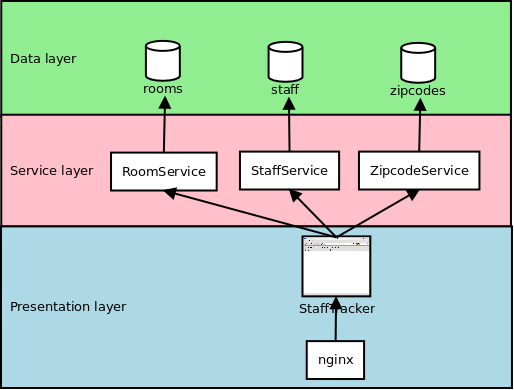

disnix-stafftracker-nodejs-example
==================================
This is an example case representing a system to manage staff of a university
department. The system uses data stored in several databases. For each database,
a REST interface is provided to retrieve and update records. A web application
front-end is provided for end-users to retrieve and edit staff members.

Architecture
============


The above figure shows the architecture of this example, consisting of three
layers. The data layer contains various Mongo databases storing data sets. The
service layer provides RESTful web interfaces to the databases. The presentation
layer contains a web application front-end which can be used by end users to
manage staff of a university. The web application front-end is placed behind an
`nginx` reverse proxy instance that caches the results of the requests to
improve performance.

All the components in the figure are *distributable* components (or *services*)
which can deployed to various machines in the network.

Usage
=====
The `deployment/DistributedDeployment` sub folder contains all neccessary Disnix
models, such as a services, infrastructure and distribution models required for
deployment.

The models come in two variants:
* The standard variant, e.g. `services.nix`, `infrastructure.nix` and
  `distribution.nix` can be used to deploy services to a network of machines
  that already provide pre-deployed container services, e.g. MongoDB
* The self-contained variant, e.g. `services-with-containers.nix`,
  `distribution-with-containers.nix` deploy both the application services and
  their underlying container services, e.g. MongoDB, using the experimental
  [Nix process management framework](https://github.com/svanderburg/nix-processmgmt)

Deployment using Disnix to a predeployed network of container services
----------------------------------------------------------------------
For this scenario only installation of the basic Disnix toolset is required.
First, you must manually install a network of machines running the Disnix service.
Then you must adapt the infrastructure model to match to properties of your
network and the distribution model to map the services to the right machines.

To deploy the databases you must install [MongoDB](http://www.mongodb.org).
Check the instructions of your Linux
distribution or the software distributions themselves how to install these system
services. Dysnomia detects the presence of these system services and configures
the corresponding modules to use them.

The system can be deployed by running the following command:

```bash
$ disnix-env -s services.nix -i infrastructure.nix -d distribution.nix
```

We can also deploy the system in which Nginx caches incoming requests:

```bash
$ disnix-env -s services-with-caching.nix -i infrastructure.nix -d distribution.nix
```

Deployment of the self-contained example with Disnix
----------------------------------------------------
It is also possible to deploy the self-contained example with the basic Disnix
toolset:

```bash
$ disnix-env -s services-with-containers.nix -i infrastructure.nix -d distribution-with-containers.nix
```

To make the above example work, a network of machines that have the Disnix
service installed are required with a `infrastructure.nix` model providing their
connectivity settings.

Deployment using the NixOS test driver
--------------------------------------
This system can be deployed without adapting any of the models in
`deployment/DistributedDeployment`. By running the following instruction, the
variant without the proxy can be deployed in a network of virtual machines:

```bash
$ disnixos-vm-env -s services.nix -n network.nix -d distribution.nix
```

The variant with caching enabled can be deployed as follows:

```bash
$ disnixos-vm-env -s services-with-caching.nix -n network.nix -d distribution.nix
```

We can deploy the self-contained example (that also includes the container
services) with:

```bash
$ disnixos-vm-env -s services-with-containers.nix -n network.nix -d distribution-with-containers.nix
```

Deployment using NixOps for infrastructure and Disnix for service deployment
----------------------------------------------------------------------------
It's also possible to use NixOps for deploying the infrastructure (machines) and
let Disnix do the deployment of the services to these machines.

A virtualbox network can be deployed as follows:

```bash
$ nixops create ./network.nix ./network-virtualbox.nix -d vboxtest
$ nixops deploy -d vboxtest
```

The services can be deployed by running the following commands:

```bash
$ export NIXOPS_DEPLOYMENT=vboxtest
$ disnixos-env -s services.nix -n network.nix -d distribution.nix --use-nixops
```

The variant with caching enabled can be deployed as follows:

```bash
$ export NIXOPS_DEPLOYMENT=vboxtest
$ disnixos-env -s services-with-caching.nix -n network.nix -d distribution.nix --use-nixops
```

The variant with container services included can be deployed with:

```bash
$ export NIXOPS_DEPLOYMENT=vboxtest
$ disnixos-env -s services-with-containers.nix -n network.nix -d distribution.nix --use-nixops
```

Running the system
==================
After the system has been deployed, open a web browser and type the following URL:

    http://test1

The `test1` hostname must be replaced by the real hostname of the machine to
which the web application front-end is deployed. Check the distribution model for
this. If the network expression is used included in this example, the third
machine in the network machine automatically boots into IceWM and includes the
Mozilla Firefox web browser for convenience.

License
=======
This package is released under the [MIT license](http://opensource.org/licenses/MIT).
